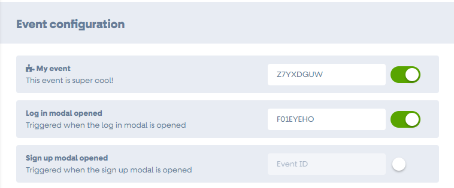

# Fathom Analytics

 [](https://packagist.org/packages/blomstra/fathom-analytics) [](https://packagist.org/packages/blomstra/fathom-analytics)

A [Flarum](http://flarum.org) extension. Integrate Fathom Analytics into your Flarum forum.

You can add custom events through your own extension! For more info, read the [extending](#extending) section

## Installation

Install with composer:

```sh
composer require blomstra/fathom-analytics:"*"
```

## Updating

```sh
composer update blomstra/fathom-analytics:"*"
php flarum migrate
php flarum cache:clear
```

## Links

- [Packagist](https://packagist.org/packages/blomstra/fathom-analytics)
- [GitHub](https://github.com/blomstra/fathom-analytics)
- [Discuss](https://discuss.flarum.org/d/PUT_DISCUSS_SLUG_HERE)

## Extending

This extension is designed to be built upon by other Flarum extensions. We've tried to make this as simple as possible for you to do.

### Creating an event

All custom events should be defined in your extension's `common` folder. Create a new folder inside `js/src/common` named `fathomEvents`. This is where all your custom events will be stored.

Create a new Javascript/Typescript file in this folder with the following template:

```ts
import { extend } from "flarum/common/extend";

export default {
  name: "My event",
  description: "Triggered when someone does something",
  id: "extension_name.event_name",
  code(e) {
    // tracking code
  },
};
```

Fill in the metadata accurately. **It's strongly recommended that your `id` is scoped to your extension to prevent conflicts.**

You can import any Flarum code into this file, and run it inside the `code(e) { }` method. To track an event occurring, call `e.track()` and the extension will handle the rest.

> :warning: Due to how the Fathom extension is designed, you will often need to import files from the `forum` namespace from Flarum or other extensions. This is ok, even though this file is in `common`, provided you only use these imports inside the `code(e)` method.

For example, if you want to track when any button is clicked in Flarum, your event might look like this:

```ts
import { extend } from "flarum/common/extend";
import Button from "flarum/common/components/Button";

export default {
  name: "Button clicked",
  description: "Triggered when any button is clicked",
  id: "my_extension.any_button_clicked",
  code(e) {
    const track = () => e.track();

    extend(Button.prototype, ["oncreate", "onupdate"], function () {
      this.$().on("click", track);
    });

    extend(Button.prototype, "onremove", function () {
      this.$().off("click", track);
    });
  },
};
```

For more examples of events, check out the default events included with the extension: [`js/src/common/DefaultEvents`](js/src/common/DefaultEvents).

### Registering your events

After you define your events, you need to register them with the extension.

To do this, create a new file at `src/js/common/registerFathomEvents.js`.

In this file, export a function which registers your events with `app.fathomEventsRepository`:

```js
import app from "flarum/common/app";

import AnyButtonClicked from "./fathomEvents/AnyButtonClicked";

export function registerFathomEvents() {
  // Don't attempt to register events when the
  // Fathom Analytics extension is disabled
  if (!("blomstra-fathom-analytics" in flarum.extensions)) return;

  app.fathomEventsRepository.registerEvent(AnyButtonClicked);
}
```

You should import and call this `registerFathomEvents()` function in your `src/admin/index.js` and `src/forum/index.js` files.

> If you have multiple custom events, you can chain calls to `registerEvent()`:
>
> ```js
> app.fathomEventsRepository
>   .registerEvent(MyEvent1)
>   .registerEvent(MyEvent2)
>   .registerEvent(MyEvent3);
> ```

If you build your extension JS, you should see your custom event(s) inside the Fathom Analytics extension settings. Custom events are accompanied by a small plug-in icon to show that they are from another extension.



### Typescript support

For Typescript typings support, copy the code below into a new file at `js/src/@types/fathom.d.ts`. Typescript should automatically pick this up and remove those red squiggles under your code:

```ts
type FathomEventParams = Pick<
  FathomEvent,
  "id" | "code" | "name" | "description"
>;

interface FathomEventAttributeData {
  [key: string]: {
    eventId: string;
    enabled: boolean;
  };
}

interface EventsRepository {
  // private events: Record<string, FathomEvent> = {};

  getAllEvents(): FathomEvent[];

  registerEvent(event: FathomEventParams): EventsRepository;

  getEnabledEvents(): FathomEvent[];

  isEventEnabled(eventId: string): boolean;

  getServerEventData(): FathomEventAttributeData;

  propogateServerEventData(): void;

  saveServerEventData(eventData: FathomEventAttributeData): Promise<void>;

  getEnabledEventIDs(): string[];
}

declare module "flarum/common/Application" {
  export default interface Application {
    fathomEventsRepository: EventsRepository;
  }
}

export interface FathomEvent {
  /**
   * Unique ID to represent the event
   *
   * You should prefix this with your extension ID to avoid collisions
   */
  id: string;

  /**
   * A code snippet to execute to set up the event.
   *
   * If your event needs to extend core or extension JS, you should call
   * `extend` or `override` within this snippet.
   *
   * This will only be executed if the event is enabled in the admin
   * dashboard.
   *
   * `this` will be assigned to the FathomEvent object.
   *
   * To log the event, call `e.track()`.
   *
   * **You can use `forum`-scoped imports within this block as the
   * code will never be executed on the admin dashboard.**
   */
  code: (e: FathomEvent) => boolean | void;

  /**
   * An array of extension IDs exposed in `flarum.extensions` to check exist before enabling an event.
   *
   * This is useful if your event depends on an extension, for example.
   *
   * @example `['flarum-tags']`
   */
  requiresExtensions?: string[];

  /**
   * A name for the event to show in the admin dashboard
   */
  name: string;

  /**
   * A description for the event to show in the admin dashboard
   */
  description: string;

  /**
   * Fathom event ID for tracking purposes.
   */
  fathomEventId: string;

  /**
   * Log the event to Fathom.
   */
  track: () => void;
}
```
